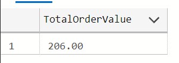

# Projekt Bazy Danych


## Jakub Młocek, Julia Sadecka, Jakub Augustyn


## Role:


* Admin (A)
* Menedżer (M)
* Szef Kuchni (S)
* Kelner (K)
* Użytkownik (U)
* System (SYS)


## Funkcje:


* Rezerwacja stolików (U,W,M,A)
* Wystawianie zbiorowej faktury pod koniec każdego miesiąca (M,A)
* Możliwość zmiany dostępnego menu (S,M,A)
* Obsługa zamówień dań specjalnych (owoce morza) z wyprzedzeniem (K,S,M,A)
* Inwentaryzacja (S,M,A)
* Potwierdzenie Rezerwacji (dostępność)(A,M,K)
* Modyfikacja i zarządzanie Rezerwacji (usunięcie) (A,M,K,U)
* Modyfikacja parametru WZ i WK (A,M)
* Generowanie raportu dotyczącego zamówień, przychodów, rezerwacji stolików, menu itp. (Raport dla restauracji) (A,M)
* Generowanie raportów dotyczących zamówień/rezerwacji klientów(A,M,U)
* Sprawdzanie ,,świeżości” menu, dostępności produktów (SYS)


## Schemat:


<p id="gdcalert1" ><span style="color: red; font-weight: bold">>>>>>  gd2md-html alert: inline image link here (to images/image1.png). Store image on your image server and adjust path/filename/extension if necessary. </span><br>(<a href="#">Back to top</a>)(<a href="#gdcalert2">Next alert</a>)<br><span style="color: red; font-weight: bold">>>>>> </span></p>


<p id="gdcalert2" ><span style="color: red; font-weight: bold">>>>>>  gd2md-html alert: inline image link here (to images/image2.png). Store image on your image server and adjust path/filename/extension if necessary. </span><br>(<a href="#">Back to top</a>)(<a href="#gdcalert3">Next alert</a>)<br><span style="color: red; font-weight: bold">>>>>> </span></p>


<p id="gdcalert3" ><span style="color: red; font-weight: bold">>>>>>  gd2md-html alert: inline image link here (to images/image3.png). Store image on your image server and adjust path/filename/extension if necessary. </span><br>(<a href="#">Back to top</a>)(<a href="#gdcalert4">Next alert</a>)<br><span style="color: red; font-weight: bold">>>>>> </span></p>


## Opis Tabeli

Tabela **Dishes** - posiada informacje o potrawach dostępnych (bądź kiedyś dostępnych)  w restauracji. Wykorzystywana jest do tworzenia Menu


* Dish_ID - int - PK,FK - klucz główny tabeli, unikalne ID każdego dania
* UnitPrice - money - cena jednej jednostki potrawy
* In_Stock - int - ilość dostępnych jednostek produktu (może być NULL)
* From_Date - datetime - początek dostępności
* Due_Date - datetime - zakończenie dostępności ( może być NULL)

**Warunki integralności**


* Dish_ID -  Autoinkrementacja
* UnitPrice - większe od 0
* In_Stock - Wartości większe, bądź równe 0
* Due_Date - Wartość większa od From_Date lub równa Null


```
CREATE TABLE "Dishes" (
   "Dish_ID" int  NOT NULL IDENTITY(1, 1),
   "UnitPrice" money  NOT NULL,
   "In_Stock" int  NULL,
   "From_Date" datetime  NOT NULL,
   "Due_Date" datetime  NULL,
   CONSTRAINT "Dishes_Dish_ID_check" CHECK ((Dish_ID > 0)),
   CONSTRAINT "Dishes_UnitPrice_check" CHECK ((UnitPrice > 0) ),
   CONSTRAINT "Dishes_DueDate_check" CHECK (((Due_Date > From_Date) OR ISNULL(Due_Date,0)=0)),
   CONSTRAINT "Dishes_In_Stock" CHECK ((In_Stock >= 0)),
   CONSTRAINT "Dishes_pk" PRIMARY KEY  ("Dish_ID")
);
```


Tabela **Products** - tabela słownikowa zawierająca ID każdego produktu i jego nazwę


* Dish_ID - int - PK - klucz główny tabeli, unikalne ID każdego dania
* Category_ID - int - FK - ID kategorii produktu
* ProductName - varchar(30) - nazwa produktu (np. zupa pomidorowa)

**Warunki integralności**


* Dish_ID - Autoinkrementacja
* ProductName - Unikatowość


```
CREATE TABLE "Products" (
   "Dish_ID" int  NOT NULL,
   "Category_ID" int  NOT NULL,
   "ProductName" varchar(30)  NOT NULL,
   CONSTRAINT "ProductNameKey" UNIQUE ("ProductName"),
   CONSTRAINT "Products_DishID_Check" CHECK ((Dish_ID > 0)),
   CONSTRAINT "Products_CategoryID_Check" CHECK ((Category_ID > 0)),
   CONSTRAINT "Products_pk" PRIMARY KEY  ("Dish_ID")
);
```


Tabela **Categories **- tabela słownikowa zawierająca ID i nazwę kategorii produktu (np. zupa, przystawka)


* Category_ID - int - PK - ID kategorii produktu
* Category_Name - varchar(20) - nazwa kategorii produktu (np. zupa)

**Warunki integralności**


* Category_ID - Autoinkrementacja
* Category_Name - Unikatowość


```
CREATE TABLE "Categories" (
   "Category_ID" int  NOT NULL IDENTITY(1, 1),
   "Category_Name" varchar(20)  NOT NULL,
   CONSTRAINT "CategoryNameKey" UNIQUE ("Category_Name"),
   CONSTRAINT "Categories_Category_ID_check" CHECK ((Category_ID > 0) ),
   CONSTRAINT "Categories_pk" PRIMARY KEY  ("Category_ID")
);
```


Tabela **Orders **- tabela zawierająca informacje o zamówieniach klientów


* Order_ID - int - PK,FK - ID zamówienia
* Client_ID - int  - FK - ID klienta wykonującego zamówienie
* Order_Time - datetime - data wykonania zamówienia
* Paid_Time - datetime - data wykonania płatności (płatność może być dokonana w momencie składania rezerwacji/zamówienia lub podczas jego realizacji. Dlatego może być NULL).

**Warunki integralności**


* Order_ID - Autoinkrementacja
* Order_Time - Późniejsza lub równa aktualnej dacie
* Paid_Time - Późniejsza lub równa dacie zamówienia


```
CREATE TABLE "Orders" (
   "Order_ID" int  NOT NULL IDENTITY(1, 1),
   "Client_ID" int  NOT NULL,
   "Order_Time" datetime  NOT NULL,
   "Paid_Time" datetime  NULL,
   CONSTRAINT "Orders_ClientID_Check" CHECK ((Client_ID > 0)),
   CONSTRAINT "Orders_OrderID_Check" CHECK ((Order_ID > 0)),
   CONSTRAINT "Orders_PaidTime_Check" CHECK ((Paid_Time >= Order_Time)),
   CONSTRAINT "Orders_pk" PRIMARY KEY  ("Order_ID")
);
```


Tabela **Dine_In **- posiada ID zamówień złożonych na miejscu


* Order_ID - int - PK - ID zamówienia

**Warunki integralności**


* Order_ID


```
CREATE TABLE "Dine_In" (
   "Order_ID" int  NOT NULL,
   CONSTRAINT "Dine_In_pk" PRIMARY KEY  ("Order_ID")
);
```


Tabela **Take_Away_Details **- posiada ID zamówień, które są przygotowywane na wynos i czas ich odebrania


* Order_ID - int - PK - ID zamówienia
* Collect_Time - datetime - data odebrania zamówienia, przekazana przez klienta

**Warunki integralności**


* Order_ID 
* Collect_Time - datetime - data odebrania zamówienia, przekazana przez klienta


```
CREATE TABLE "Take_Away_Details" (
   "Order_ID" int  NOT NULL,
   "Collect_Time" datetime  NOT NULL,
   CONSTRAINT "Take_Away_Details_pk" PRIMARY KEY  ("Order_ID")
);
```


 	

Tabela **Order_Details **- posiada szczegóły zamówień (ilość każdego zamówionego dania)


* Order_ID - int - PK,FK - ID zamówienia
* Dish_ID - int - PK,FK - ID konkretnego dania zamówionego
* Quantity - int - ilość konkretnego dania

**Warunki integralności**


* Order_ID - Wartość większa od 0
* Dish_ID - Wartość większa od 0
* Quantity - Wartość większa od 0


```
CREATE TABLE "Order_Details" (
   "Order_ID" int  NOT NULL,
   "Dish_ID" int  NOT NULL,
   "Quantity" int  NOT NULL,
   CONSTRAINT "OrderDetails_OrderID_Check" CHECK ((Order_ID > 0)),
   CONSTRAINT "OrderDetails_DishID_Check" CHECK ((Dish_ID > 0)),
   CONSTRAINT "OrderDetails_Quantity_Check" CHECK ((Quantity > 0)),
   CONSTRAINT "Order_Details_pk" PRIMARY KEY  ("Order_ID","Dish_ID")
);
```


 Tabela **Clients **- posiada informacje o wszystkich klientach


* Client_ID - int - PK,FK - ID każdego klienta
* First_Name - varchar(20) - imię klienta
* Last_Name - varchar(20) - nazwisko klienta
* Email - varchar(50) - mail klienta (wymagane)
* Phone - varchar(20) - telefon klienta (może być NULL)

**Warunki integralności**


* Client_ID - Autoinkrementacja
* First_Name
* Last_Name
* Email - Unikatowość, czy zawiera ‘@’ i ‘.’
* Phone - złożony jedynie z cyfr  lub jest NULLem (+48 w bazie zapisywane jako 0048)


```
CREATE TABLE "Clients" (
   "Client_ID" int  NOT NULL IDENTITY(1, 1),
   "First_Name" varchar(20)  NOT NULL,
   "Last_Name" varchar(20)  NOT NULL,
   "Email" varchar(50)  NOT NULL,
   "Phone" varchar(20)  NULL,
   CONSTRAINT "Clients_Email" UNIQUE ("Email"),
   CONSTRAINT "Clients_ClientID_Check" CHECK ((Client_ID > 0)),
   CONSTRAINT "Clients_Phone_Check" CHECK ((ISNUMERIC(Phone)=1 OR ISNULL(Phone,0)=0)),
   CONSTRAINT "Clients_Email_Check" CHECK ((Email LIKE '%@%.%')),
   CONSTRAINT "Clients_pk" PRIMARY KEY  ("Client_ID")
);
```


Tabela **Individual_Clients **- tabela zawierająca ID klientów indywidualnych (aby odróżnić ich od biznesowych)


* Client_ID - int - PK - ID klienta


```
CREATE TABLE "Individual_Clients" (
   "Client_ID" int  NOT NULL,
   CONSTRAINT "Individual_Clients_pk" PRIMARY KEY  ("Client_ID")
);
```


**Warunki integralności:**


* Client_ID 

Tabela **Bussiness_Clients **- tabela zawierająca ID klientów biznesowych, z konkretnej firmy


* Client_ID - int - PK - ID klienta
* Company_ID - int - FK - ID firmy \


```
CREATE TABLE "Bussiness_Clients" (
   "Company_ID" int  NOT NULL,
   "Client_ID" int  NOT NULL,
   CONSTRAINT "Bussiness_Clients_CompanyID_Check" CHECK ((Company_ID > 0)),
   CONSTRAINT "Bussiness_Clients_ClientID_Check" CHECK ((Client_ID > 0)),
   CONSTRAINT "Bussiness_Clients_pk" PRIMARY KEY  ("Client_ID")
);
```


**Warunki integralności:**


* Client_ID
* Company_ID 

Tabela **Company **- tabela słownikowa zawierająca ID konkretnej firmy


* Company_ID - int - PK - ID firmy
* Company_Na - varchar(20) - nazwa firmy
* NIP - varchar(10) - numer NIP firmy do wystawienia faktury


```
CREATE TABLE "Company" (
   "Company_ID" int  NOT NULL IDENTITY(1, 1),
   "Company_Name" varchar(20)  NOT NULL,
   "NIP" varchar(10)  NOT NULL,
   CONSTRAINT "ComapnyNameKey" UNIQUE ("Company_Name"),
   CONSTRAINT "CompanyNIP" UNIQUE ("NIP"),
   CONSTRAINT "Company_NIP_Check" CHECK ((ISNUMERIC(NIP)=1)),
   CONSTRAINT "Company_pk" PRIMARY KEY  ("Company_ID")
);
```


**Warunki integralności:**


* Company_ID - Autoinkrementacja
* Company_Na 
* NIP - Złożony jedynie z cyfr

Tabela **Reservations **- tabela zawierająca informacje o rezerwacji


* Reservation_ID - int - PK - unikalne ID rezerwacji
* Order_ID - int - FK - ID zamówienia (ponieważ przy rezerwacji należy złożyć zamówienie
* Guests - int - liczba gości 
* Date - datetime - Data rezerwacji (data i godzina)


```
CREATE TABLE "Reservations" (
   "Reservation_ID" int  NOT NULL IDENTITY(1, 1),
   "Order_ID" int  NOT NULL,
   "Guests" int  NOT NULL,
   "Date" datetime  NOT NULL,
   CONSTRAINT "Reservations_Reservation_ID_check" CHECK ((Reservation_ID > 0) ),
   CONSTRAINT "Reservations_Date_Check" CHECK ((Date >= GETDATE()) ),
   CONSTRAINT "Reservations_Guests_check" CHECK ((Guests > 0 AND Guests < 30) ),
   CONSTRAINT "Reservations_pk" PRIMARY KEY  ("Reservation_ID")
);
```


**Warunki integralności:**


* Reservation_ID - Autoinkrementacja
* Order_ID - 
* Guests - wartość od 0 do 30
* Date - czy data jest większa od teraźniejszej daty

Tabela **Reservation_Tables **- tabela zawierająca informacje przy jakim stoliku znajduje się rezerwacja


* Reservation_ID - int - PK,FK - ID rezerwacji
* Table_ID - int - PK,FK - ID stolika przy którym znajduje się rezerwacja


```
CREATE TABLE "Reservation_Tables" (
   "Reservation_ID" int  NOT NULL,
   "Table_ID" int  NOT NULL,
   CONSTRAINT "Reservations_Tables_Table_ID_check" CHECK ((Table_ID > 0) ),
   CONSTRAINT "Reservation_Tables_pk" PRIMARY KEY  ("Reservation_ID","Table_ID")
);
```


**Warunki integralności:**


* Reservation_ID 
* Table_ID - Wartość większa od 0

Tabela **Tables **- tabela słownikowa zawierająca ID stolika i liczbę krzeseł przy nim


* Table_ID - int - PK - ID stolika 
* chair - int - liczba krzeseł/osób mogących usiąść przy stoliku


```
CREATE TABLE "Tables" (
   "Table_ID" int  NOT NULL IDENTITY(1, 1),
   "chair" int  NOT NULL,
   CONSTRAINT "Tables_chair_check" CHECK ((chair > 0) AND (chair < 30)),
   CONSTRAINT "Tables_pk" PRIMARY KEY  ("Table_ID")
);
```


**Warunki integralności:**


* Table_ID - Autoinkrementacja
* chair - wartość od 0 do 30

Tabela **Values **- tabela przetrzymująca wartości


* Value_ID - int - PK - identyfikator stałej wartości
* Name - varchar(20) - nazwa stałej wartości
* Value - int - wartość stała (np. _WK, WZ_)


```
CREATE TABLE "Values" (
   "Value_ID" int  NOT NULL IDENTITY(1, 1),
   "Name" varchar(20)  NOT NULL,
   "Value" int  NOT NULL,
   CONSTRAINT "Values_pk" PRIMARY KEY  ("Value_ID")
);
```


**Warunki integralności **


* Value_ID - Autoinkrementacja


## Widoki:

Wyświetlanie danych klientów indywidualnych:


```
CREATE VIEW v_individual_clients
AS
SELECT First_Name, Last_Name, Email, Phone
FROM Clients
WHERE Client_ID IN (
   SELECT Client_ID FROM Individual_Clients
)
```


<p id="gdcalert4" ><span style="color: red; font-weight: bold">>>>>>  gd2md-html alert: inline image link here (to images/image4.png). Store image on your image server and adjust path/filename/extension if necessary. </span><br>(<a href="#">Back to top</a>)(<a href="#gdcalert5">Next alert</a>)<br><span style="color: red; font-weight: bold">>>>>> </span></p>


Wyświetlanie danych klientów biznesowych:


```
CREATE VIEW v_bussiness_clients
AS
SELECT Company_Name, NIP, Email, Phone
FROM Company
INNER JOIN Bussiness_Clients ON Company.Company_ID = Bussiness_Clients.Company_ID
INNER JOIN Clients ON Bussiness_Clients.Client_ID = Clients.Client_ID
```


<p id="gdcalert5" ><span style="color: red; font-weight: bold">>>>>>  gd2md-html alert: inline image link here (to images/image5.png). Store image on your image server and adjust path/filename/extension if necessary. </span><br>(<a href="#">Back to top</a>)(<a href="#gdcalert6">Next alert</a>)<br><span style="color: red; font-weight: bold">>>>>> </span></p>


Wyświetlanie klientów po największej ilości zamówień:


```
CREATE VIEW v_clients_by_num_of_orders
AS
SELECT Clients.Client_ID, First_Name, Last_Name, count(Order_ID) as liczba_zamowien
FROM Clients inner join Orders O on Clients.Client_ID = O.Client_ID
GROUP BY Clients.Client_ID, First_Name, Last_Name
```


<p id="gdcalert6" ><span style="color: red; font-weight: bold">>>>>>  gd2md-html alert: inline image link here (to images/image6.png). Store image on your image server and adjust path/filename/extension if necessary. </span><br>(<a href="#">Back to top</a>)(<a href="#gdcalert7">Next alert</a>)<br><span style="color: red; font-weight: bold">>>>>> </span></p>


Wyświetlanie wartości dla każdego zamówienia:


```
CREATE VIEW v_value_of_order
AS
SELECT O.Order_ID, sum(Quantity * UnitPrice) as wartosc_zamowienia
FROM Order_Details as O inner join Dishes D on O.Dish_ID = D.Dish_ID
GROUP BY O.Order_ID
```


<p id="gdcalert7" ><span style="color: red; font-weight: bold">>>>>>  gd2md-html alert: inline image link here (to images/image7.png). Store image on your image server and adjust path/filename/extension if necessary. </span><br>(<a href="#">Back to top</a>)(<a href="#gdcalert8">Next alert</a>)<br><span style="color: red; font-weight: bold">>>>>> </span></p>


Wyświetlanie nieopłacone zamówienia wraz z dodatkowymi informacjami:


```
CREATE VIEW v_not_paid_orders_with_additional_informations
AS
SELECT OD.Order_ID, Order_Time, First_Name, Last_Name, Phone, Email, sum(Quantity * UnitPrice) as wartosc_zamowienia
FROM Order_Details as OD inner join Dishes D on OD.Dish_ID = D.Dish_ID
inner join Orders O on OD.Order_ID = O.Order_ID
inner join Clients C on O.Client_ID = C.Client_ID
WHERE Paid_time is null
GROUP BY OD.Order_ID, Order_Time, First_Name, Last_Name, Phone, Email
```


<p id="gdcalert8" ><span style="color: red; font-weight: bold">>>>>>  gd2md-html alert: inline image link here (to images/image8.png). Store image on your image server and adjust path/filename/extension if necessary. </span><br>(<a href="#">Back to top</a>)(<a href="#gdcalert9">Next alert</a>)<br><span style="color: red; font-weight: bold">>>>>> </span></p>


Wyświetlanie dla każdego klienta informacji o ilości jego nieopłaconych zamówień i sumie ich wartości:


```
CREATE VIEW v_informations_of_client_orders
AS
SELECT C.Client_ID, First_Name, Last_Name, count(O.Order_ID) as ilosc_zamowien ,sum(Quantity * UnitPrice) as wartosc_zamowien
FROM Order_Details as OD inner join Dishes D on OD.Dish_ID = D.Dish_ID
inner join Orders O on OD.Order_ID = O.Order_ID
inner join Clients C on O.Client_ID = C.Client_ID
WHERE Paid_Time is null
GROUP BY C.Client_ID, First_Name, Last_Name
```


<p id="gdcalert9" ><span style="color: red; font-weight: bold">>>>>>  gd2md-html alert: inline image link here (to images/image9.png). Store image on your image server and adjust path/filename/extension if necessary. </span><br>(<a href="#">Back to top</a>)(<a href="#gdcalert10">Next alert</a>)<br><span style="color: red; font-weight: bold">>>>>> </span></p>


Wyświetla stoliki, które są aktualnie dostępne (dodaje 3 godziny do aktualnej daty)


```
CREATE VIEW v_available_tables
AS
SELECT t.Table_ID, t.chair FROM Tables AS t
LEFT JOIN Reservation_Tables AS rt ON t.Table_ID = rt.Table_ID
LEFT JOIN Reservations AS r ON r.Reservation_ID = rt.Reservation_ID
WHERE t.Table_ID NOT IN
(SELECT Table_ID FROM Reservation_Tables AS rt_wew
INNER JOIN Reservations AS r_wew ON r_wew.Reservation_ID = rt_wew.Reservation_ID
WHERE r_wew.[Date] BETWEEN GETDATE() AND DATEADD(hour, 3, GETDATE()))
```


<p id="gdcalert10" ><span style="color: red; font-weight: bold">>>>>>  gd2md-html alert: inline image link here (to images/image10.png). Store image on your image server and adjust path/filename/extension if necessary. </span><br>(<a href="#">Back to top</a>)(<a href="#gdcalert11">Next alert</a>)<br><span style="color: red; font-weight: bold">>>>>> </span></p>


Wyświetla przychód tygodniowy restauracji


```
CREATE VIEW v_week_revenue AS
SELECT sum(S.wartosc_zamowienia) AS tygodniowy_przychod
FROM
(SELECT O.Order_ID, sum(Quantity * UnitPrice) AS wartosc_zamowienia
FROM Order_Details AS O
INNER JOIN Dishes AS D ON O.Dish_ID = D.Dish_ID
GROUP BY O.Order_ID) AS S
INNER JOIN Orders AS O ON O.Order_ID = S.Order_ID
WHERE O.Order_Time BETWEEN DATEADD(day, -7, GETDATE()) AND GETDATE()
```


<p id="gdcalert11" ><span style="color: red; font-weight: bold">>>>>>  gd2md-html alert: inline image link here (to images/image11.png). Store image on your image server and adjust path/filename/extension if necessary. </span><br>(<a href="#">Back to top</a>)(<a href="#gdcalert12">Next alert</a>)<br><span style="color: red; font-weight: bold">>>>>> </span></p>


```
Wyświetla miesięczny przychód restauracji

CREATE VIEW v_month_revenue AS
SELECT sum(S.wartosc_zamowienia) AS miesieczny_przychod
FROM
(SELECT O.Order_ID, sum(Quantity * UnitPrice) AS wartosc_zamowienia
FROM Order_Details AS O
INNER JOIN Dishes AS D ON O.Dish_ID = D.Dish_ID
GROUP BY O.Order_ID) AS S
INNER JOIN Orders AS O ON O.Order_ID = S.Order_ID
WHERE O.Order_Time BETWEEN DATEADD(month, -1, GETDATE()) AND GETDATE()
```


<p id="gdcalert12" ><span style="color: red; font-weight: bold">>>>>>  gd2md-html alert: inline image link here (to images/image12.png). Store image on your image server and adjust path/filename/extension if necessary. </span><br>(<a href="#">Back to top</a>)(<a href="#gdcalert13">Next alert</a>)<br><span style="color: red; font-weight: bold">>>>>> </span></p>


Wyświetlanie aktualnego menu


```
CREATE VIEW v_current_menu
AS
SELECT ProductName, UnitPrice
FROM Dishes
INNER JOIN Products ON Dishes.Dish_ID = Products.Dish_ID
WHERE In_Stock > 0 AND Due_Date IS NOT NULL
```


<p id="gdcalert13" ><span style="color: red; font-weight: bold">>>>>>  gd2md-html alert: inline image link here (to images/image13.png). Store image on your image server and adjust path/filename/extension if necessary. </span><br>(<a href="#">Back to top</a>)(<a href="#gdcalert14">Next alert</a>)<br><span style="color: red; font-weight: bold">>>>>> </span></p>


## Funkcje:

Funkcja zwracająca listę zamówień danego klienta w określonym przedziale czasowym:


```
CREATE FUNCTION dbo.ZamowieniaKlienta(@ID_klienta INT, @Data_poczatkowa DATE, @Data_koncowa DATE)
RETURNS TABLE
AS
RETURN (
   SELECT *
   FROM Orders
   WHERE Client_ID = @ID_klienta
   AND Order_Time BETWEEN @Data_poczatkowa AND @Data_koncowa
)

SELECT * FROM ZamowieniaKlienta(10, '20230101', '20231212')
```


<p id="gdcalert14" ><span style="color: red; font-weight: bold">>>>>>  gd2md-html alert: inline image link here (to images/image14.png). Store image on your image server and adjust path/filename/extension if necessary. </span><br>(<a href="#">Back to top</a>)(<a href="#gdcalert15">Next alert</a>)<br><span style="color: red; font-weight: bold">>>>>> </span></p>


Funkcja zwracająca sumę zamówienia konkretnego klienta: \
`CREATE FUNCTION dbo.TotalClientOrderValue(@ID_klienta INT)`


```
RETURNS DECIMAL(10, 2)
AS
BEGIN
   DECLARE @wartosc DECIMAL(10, 2);
   SELECT @wartosc = SUM(Quantity * D.UnitPrice)
   FROM Order_Details AS OD
   INNER JOIN Orders AS O ON OD.Order_ID = O.Order_ID
   INNEr JOIN Dishes AS D ON OD.Dish_ID = D.Dish_ID
   WHERE O.Client_ID = @ID_klienta;

   IF @wartosc IS NULL
      SET @wartosc = 0;

   RETURN @wartosc;
END;

Użycie:
DECLARE @clientID INT = 10; 

SELECT dbo.TotalClientOrderValue(@clientID) AS TotalOrderValue;
```


<p id="gdcalert15" ><span style="color: red; font-weight: bold">>>>>>  gd2md-html alert: inline image link here (to images/image15.png). Store image on your image server and adjust path/filename/extension if necessary. </span><br>(<a href="#">Back to top</a>)(<a href="#gdcalert16">Next alert</a>)<br><span style="color: red; font-weight: bold">>>>>> </span></p>


Funcja zwracająca wartość zamóweinia:


```
CREATE FUNCTION dbo.OrderValue(@clientID INT, @orderID INT)
RETURNS DECIMAL(10, 2)
AS
BEGIN
   DECLARE @wartosc DECIMAL(10, 2);
   SELECT @wartosc = SUM(Quantity * D.UnitPrice)
   FROM Order_Details AS OD
   INNER JOIN Dishes AS D ON OD.Dish_ID = D.Dish_ID
   WHERE OD.Order_ID = @orderID;

   IF @wartosc IS NULL
      SET @wartosc = 0;

   RETURN @wartosc;
END;

DECLARE @clientID INT = 10;
DECLARE @orderID INT = 20;

SELECT dbo.OrderValue(@clientID, @orderID) AS OrderValue;
```


<p id="gdcalert16" ><span style="color: red; font-weight: bold">>>>>>  gd2md-html alert: inline image link here (to images/image16.png). Store image on your image server and adjust path/filename/extension if necessary. </span><br>(<a href="#">Back to top</a>)(<a href="#gdcalert17">Next alert</a>)<br><span style="color: red; font-weight: bold">>>>>> </span></p>


Funkcja wyświetlająca wartość zamówień raz na miesiąc:


```
CREATE FUNCTION dbo.ClientMonthlyOrderValue(@clientID INT, @year INT, @month INT)
RETURNS DECIMAL(10, 2)
AS
BEGIN
   DECLARE @wartosc DECIMAL(10, 2);
   SELECT @wartosc = SUM(Quantity * D.UnitPrice)
   FROM Order_Details AS OD
   INNER JOIN Orders AS O ON OD.Order_ID = O.Order_ID
   INNER JOIN Dishes AS D ON OD.Dish_ID = D.Dish_ID
   WHERE O.Client_ID = @clientID
     AND YEAR(O.Order_Time) = @year
     AND MONTH(O.Order_Time) = @month;
   IF @wartosc IS NULL
      SET @wartosc = 0;
   RETURN @wartosc;
END;

DECLARE @clientID INT = 15;
DECLARE @year INT = 2023;
DECLARE @month INT = 3;
SELECT dbo.ClientMonthlyOrderValue(@clientID, @year, @month) AS MonthlyOrderValue;
```


<p id="gdcalert17" ><span style="color: red; font-weight: bold">>>>>>  gd2md-html alert: inline image link here (to images/image17.png). Store image on your image server and adjust path/filename/extension if necessary. </span><br>(<a href="#">Back to top</a>)(<a href="#gdcalert18">Next alert</a>)<br><span style="color: red; font-weight: bold">>>>>> </span></p>


Funkcja wyświetlająca Top 5 zamawianych dań:


```
CREATE FUNCTION dbo.Top5OrderedDish()
RETURNS TABLE
AS
RETURN (
   SELECT TOP 5 D.Dish_ID, P.ProductName, COUNT(*) AS [Total Order]
   FROM Order_Details AS OD
   INNER JOIN Dishes AS D ON OD.Dish_ID = D.Dish_ID
   INNER JOIN Products AS P ON D.Dish_ID = P.Dish_ID
   GROUP BY D.Dish_ID, P.ProductName
   ORDER BY COUNT(*) DESC
)

SELECT * FRom dbo.Top5OrderedDish()
```


<p id="gdcalert18" ><span style="color: red; font-weight: bold">>>>>>  gd2md-html alert: inline image link here (to images/image18.png). Store image on your image server and adjust path/filename/extension if necessary. </span><br>(<a href="#">Back to top</a>)(<a href="#gdcalert19">Next alert</a>)<br><span style="color: red; font-weight: bold">>>>>> </span></p>


Funkcja, która pokaże klientów z liczbą ich zamówień


```
CREATE FUNCTION dbo.OrderByClient()
RETURNS TABLE
AS
RETURN (
   SELECT C.Client_ID, C.First_Name, C.Last_Name, COUNT(*) AS LiczbaZamowien
   FROM Clients AS C
   INNER JOIN Orders AS O ON C.Client_ID = O.Client_ID
   GROUP BY C.Client_ID, C.First_Name, C.Last_Name
)
```


<p id="gdcalert19" ><span style="color: red; font-weight: bold">>>>>>  gd2md-html alert: inline image link here (to images/image19.png). Store image on your image server and adjust path/filename/extension if necessary. </span><br>(<a href="#">Back to top</a>)(<a href="#gdcalert20">Next alert</a>)<br><span style="color: red; font-weight: bold">>>>>> </span></p>


Funkcja wyświetlająca średnią wartość zamówień: \
`CREATE FUNCTION dbo.OrdersAverage()`


```
RETURNS DECIMAL(10, 2)
AS
BEGIN
   DECLARE @srednia DECIMAL(10, 2);
   SELECT @srednia = AVG(Quantity * D.UnitPrice)
   FROM Order_Details AS OD
   INNER JOIN Dishes AS D ON OD.Dish_ID=D.Dish_ID
   RETURN ISNULL(@srednia, 0);
END;

SELECT dbo.OrdersAverage() AS [Average Order Value];
```


<p id="gdcalert20" ><span style="color: red; font-weight: bold">>>>>>  gd2md-html alert: inline image link here (to images/image20.png). Store image on your image server and adjust path/filename/extension if necessary. </span><br>(<a href="#">Back to top</a>)(<a href="#gdcalert21">Next alert</a>)<br><span style="color: red; font-weight: bold">>>>>> </span></p>


Funkcja zwracająca listę rezerwacji dla danego stolika w określonym przedziale czasowym: \
`CREATE FUNCTION dbo.TableReservationFunction(@ID_stolika INT, @Data_poczatkowa DATE, @Data_koncowa DATE)`


```
RETURNS TABLE
AS
RETURN (
   SELECT R.Reservation_ID, R.Date, O.Client_ID, C.Last_Name
   FROM Reservations AS R
   INNER JOIN Reservation_Tables AS RT ON R.Reservation_ID = RT.Reservation_ID
   INNER JOIN Orders AS O ON R.Order_ID=O.Order_ID
   INNER JOIN Clients AS C ON O.Client_ID=C.Client_ID
   WHERE RT.Table_ID = @ID_stolika
   AND R.Date BETWEEN @Data_poczatkowa AND @Data_koncowa
)

DECLARE @ID_stolika INT = 1;
DECLARE @Data_poczatkowa DATE = '2023-06-01';
DECLARE @Data_koncowa DATE = '2023-11-30';

SELECT *
FROM dbo.TableReservationFunction(@ID_stolika, @Data_poczatkowa, @Data_koncowa);
```


<p id="gdcalert21" ><span style="color: red; font-weight: bold">>>>>>  gd2md-html alert: inline image link here (to images/image21.png). Store image on your image server and adjust path/filename/extension if necessary. </span><br>(<a href="#">Back to top</a>)(<a href="#gdcalert22">Next alert</a>)<br><span style="color: red; font-weight: bold">>>>>> </span></p>


Funkcja zwracająca listę dań w określonym przedziale cenowym: \
CREATE FUNCTION dbo.DishByPrice(@Cena_min DECIMAL(10, 2), @Cena_max DECIMAL(10, 2))


```
RETURNS TABLE
AS
RETURN (
   SELECT *
   FROM Dishes
   WHERE UnitPrice BETWEEN @Cena_min AND @Cena_max
)

DECLARE @Cena_min DECIMAL(10, 2) = 10.00;
DECLARE @Cena_max DECIMAL(10, 2) = 20.00;

SELECT *
FROM dbo.DishByPrice(@Cena_min, @Cena_max);
```


<p id="gdcalert22" ><span style="color: red; font-weight: bold">>>>>>  gd2md-html alert: inline image link here (to images/image22.png). Store image on your image server and adjust path/filename/extension if necessary. </span><br>(<a href="#">Back to top</a>)(<a href="#gdcalert23">Next alert</a>)<br><span style="color: red; font-weight: bold">>>>>> </span></p>


Funkcja sprawdzająca czy owoce morza zostały złożone w odpowiednim terminie:


```
CREATE FUNCTION CheckSeafoodOrder(
    @OrderDate datetime
)
RETURNS bit
AS
BEGIN
    DECLARE @DayOfWeek int, @MondayPrior datetime, @Deadline datetime
    DECLARE @Result bit

    SET @DayOfWeek = DATEPART(weekday, @OrderDate)

    IF @DayOfWeek IN (5, 6, 7)
    BEGIN
        SET @MondayPrior = DATEADD(day, -((@DayOfWeek + 5) % 7), @OrderDate)

        SET @Deadline = DATEADD(day, -3, @MondayPrior)

        IF @OrderDate <= @Deadline
            SET @Result = 1
        ELSE
            SET @Result = 0
    END
    ELSE
    BEGIN
        SET @Result = 1
    END

    RETURN @Result
END
```


Użycie:


```
DECLARE @OrderDate datetime = '2023-07-30'
DECLARE @SeafoodOrder bit

SET @SeafoodOrder = dbo.CheckSeafoodOrder(@OrderDate)

IF @SeafoodOrder = 1
    PRINT 'Zamówienie na dania zawierające owoce morza zostało złożone w odpowiednim czasie.'
ELSE
    PRINT 'Zamówienie na dania zawierające owoce morza zostało złożone po terminie.'
```


## Procedury:

Procedura dodająca rezerwację:


```
CREATE PROCEDURE AddReservation
    @OrderID int,
    @Guests int,
    @Date datetime
AS
BEGIN
    INSERT INTO Reservations (Order_ID, Guests, Date)
    VALUES (@OrderID, @Guests, @Date);
END
```


<p id="gdcalert23" ><span style="color: red; font-weight: bold">>>>>>  gd2md-html alert: inline image link here (to images/image23.png). Store image on your image server and adjust path/filename/extension if necessary. </span><br>(<a href="#">Back to top</a>)(<a href="#gdcalert24">Next alert</a>)<br><span style="color: red; font-weight: bold">>>>>> </span></p>


<p id="gdcalert24" ><span style="color: red; font-weight: bold">>>>>>  gd2md-html alert: inline image link here (to images/image24.png). Store image on your image server and adjust path/filename/extension if necessary. </span><br>(<a href="#">Back to top</a>)(<a href="#gdcalert25">Next alert</a>)<br><span style="color: red; font-weight: bold">>>>>> </span></p>


<p id="gdcalert25" ><span style="color: red; font-weight: bold">>>>>>  gd2md-html alert: inline image link here (to images/image25.png). Store image on your image server and adjust path/filename/extension if necessary. </span><br>(<a href="#">Back to top</a>)(<a href="#gdcalert26">Next alert</a>)<br><span style="color: red; font-weight: bold">>>>>> </span></p>


Procedura aktualizująca dane klienta:


```
CREATE PROCEDURE UpdateClient
    @ClientID int,
    @FirstName varchar(20),
    @LastName varchar(20),
    @Email varchar(50),
    @Phone varchar(20)
AS
BEGIN
    UPDATE Clients
    SET First_Name = @FirstName, Last_Name = @LastName, Email = @Email, Phone = @Phone
    WHERE Client_ID = @ClientID;
END
```


<p id="gdcalert26" ><span style="color: red; font-weight: bold">>>>>>  gd2md-html alert: inline image link here (to images/image26.png). Store image on your image server and adjust path/filename/extension if necessary. </span><br>(<a href="#">Back to top</a>)(<a href="#gdcalert27">Next alert</a>)<br><span style="color: red; font-weight: bold">>>>>> </span></p>


<p id="gdcalert27" ><span style="color: red; font-weight: bold">>>>>>  gd2md-html alert: inline image link here (to images/image27.png). Store image on your image server and adjust path/filename/extension if necessary. </span><br>(<a href="#">Back to top</a>)(<a href="#gdcalert28">Next alert</a>)<br><span style="color: red; font-weight: bold">>>>>> </span></p>


<p id="gdcalert28" ><span style="color: red; font-weight: bold">>>>>>  gd2md-html alert: inline image link here (to images/image28.png). Store image on your image server and adjust path/filename/extension if necessary. </span><br>(<a href="#">Back to top</a>)(<a href="#gdcalert29">Next alert</a>)<br><span style="color: red; font-weight: bold">>>>>> </span></p>


Procedura pobierająca listę dat zamówienia i odbioru zamówień dla danego klienta:


```
CREATE PROCEDURE GetOrdersByClient
@ClientID int
AS
BEGIN
    SELECT Order_ID, Order_Time, Paid_Time
    FROM Orders
    WHERE Client_ID = @ClientID;
END
```


<p id="gdcalert29" ><span style="color: red; font-weight: bold">>>>>>  gd2md-html alert: inline image link here (to images/image29.png). Store image on your image server and adjust path/filename/extension if necessary. </span><br>(<a href="#">Back to top</a>)(<a href="#gdcalert30">Next alert</a>)<br><span style="color: red; font-weight: bold">>>>>> </span></p>


<p id="gdcalert30" ><span style="color: red; font-weight: bold">>>>>>  gd2md-html alert: inline image link here (to images/image30.png). Store image on your image server and adjust path/filename/extension if necessary. </span><br>(<a href="#">Back to top</a>)(<a href="#gdcalert31">Next alert</a>)<br><span style="color: red; font-weight: bold">>>>>> </span></p>


Wyświetla przychód w określonych datach:


```
CREATE PROCEDURE p_custom_date_revenue
    @start_date DATE,
    @end_date DATE
AS
BEGIN
    SELECT sum(S.wartosc_zamowienia) AS przychod_w_okreslonych_datach
    FROM
        (SELECT O.Order_ID, sum(Quantity * UnitPrice) AS wartosc_zamowienia
        FROM Order_Details AS O
        INNER JOIN Dishes AS D ON O.Dish_ID = D.Dish_ID
        GROUP BY O.Order_ID) AS S
    INNER JOIN Orders AS O ON O.Order_ID = S.Order_ID
    WHERE O.Order_Time BETWEEN @start_date AND @end_date;
END;
```


Użycie:


```
DECLARE @start_date DATE = '2023-01-01';
DECLARE @end_date DATE = '2023-06-30';

EXEC p_custom_date_revenue @start_date, @end_date;
```


<p id="gdcalert31" ><span style="color: red; font-weight: bold">>>>>>  gd2md-html alert: inline image link here (to images/image31.png). Store image on your image server and adjust path/filename/extension if necessary. </span><br>(<a href="#">Back to top</a>)(<a href="#gdcalert32">Next alert</a>)<br><span style="color: red; font-weight: bold">>>>>> </span></p>


Procedura sprawdzająca czy przynajmniej połowa pozycji menu została zmieniona co najmniej raz na dwa tygodnie.


```
CREATE PROCEDURE CheckMenuChange
AS
BEGIN
   DECLARE @TotalMenuItems INT;
   DECLARE @ChangedMenuItems INT;

   SELECT @TotalMenuItems = COUNT(*) FROM v_current_menu;

   SELECT @ChangedMenuItems = COUNT(*)
   FROM v_current_menu
   WHERE From_Date >= DATEADD(week, -2, GETDATE());

   IF (@ChangedMenuItems >= @TotalMenuItems / 2)
   BEGIN
      PRINT 'Warunek został spełniony. Co najmniej połowa pozycji menu została zmieniona w ciągu ostatnich dwóch tygodni.';
   END
   ELSE
   BEGIN
    PRINT 'Warunek nie został spełniony. Co najmniej połowa pozycji menu nie została zmieniona w ciągu ostatnich dwóch tygodni.'
   END
END;
```


<p id="gdcalert32" ><span style="color: red; font-weight: bold">>>>>>  gd2md-html alert: inline image link here (to images/image32.png). Store image on your image server and adjust path/filename/extension if necessary. </span><br>(<a href="#">Back to top</a>)(<a href="#gdcalert33">Next alert</a>)<br><span style="color: red; font-weight: bold">>>>>> </span></p>


Tworzenie rezerwacji przez klienta indywidualnego: \
`CREATE PROCEDURE CreateReservationAndOrder`


```
      @ClientID int,
      @Guests int,
      @OrderTime datetime,
AS
BEGIN
    DECLARE NumOfOrders INT;
    DECLARE MinOrderValue MONEY;

    SELECT value INTO NumOfOrders FROM Values WHERE name = 'WK';
    SELECT value INTO MinOrderValue FROM Values WHERE name = 'WZ';

    IF (SELECT COUNT(Order_ID) FROM Orders WHERE Client_ID = @ClientID) < NumOfOrders
    BEGIN
        RAISERROR('Klient nie posiada wystarczajacej ilosci zamowien do dokonania rezerwacji', 16, 1)
        RETURN
    END

   IF (SELECT SUM(Quantity * UnitPrice) FROM Order_Details od INNER JOIN Dishes d ON od.Dish_ID = d.Dish_ID WHERE od.Order_ID IN (SELECT Order_ID FROM Orders WHERE Client_ID = @ClientID)) < @MinOrderValue
    BEGIN
        RAISERROR('Klient nie wykonal zamowien o wystarczajacej wartosci.', 16, 1)
        RETURN
    END

     -- Dodaj zamówienie klienta
      DECLARE @OrderID int;
      INSERT INTO Orders (Client_ID, Order_Time)
      VALUES (@ClientID, @OrderTime);
BEGIN TRANSACTION;

      SET @OrderID = SCOPE_IDENTITY();

      -- Dodaj szczegóły zamówienia
      INSERT INTO Order_Details (Order_ID, Dish_ID, Quantity)
      SELECT @OrderID, DishID, Quantity
      FROM @OrderDetails;

      -- Utwórz rezerwację
      IF (
        SELECT Client_ID, SUM(UnitPrice * Quantity) FROM Order_Details
        INNER JOIN Orders ON Orders.Order_ID = Order_Details.Order_ID
        INNER JOIN Dishes ON Order_Details.Dish_ID = Dishes.Dish_ID
        WHERE Client_ID = @Client_ID
        GROUP BY Client_ID) > (SELECT value INTO NumOfOrders FROM Values WHERE name = 'WZ')
        AND 
        (SELECT Client_ID, COUNT(Client_ID)
        FROM Orders
        WHERE Client_ID = @Client_ID
        GROUP BY Client_ID) > (SELECT value INTO NumOfOrders FROM Values WHERE name = 'WK')
        THEN
          DECLARE @ReservationID int;
          INSERT INTO Reservations (Order_ID, Guests, Date)
          VALUES (@OrderID, @Guests, @OrderTime);
    END IF;

      SET @ReservationID = SCOPE_IDENTITY();

      -- Przypisz rezerwację do stolików
      INSERT INTO Reservation_Tables (Reservation_ID, Table_ID)
      SELECT @ReservationID, t.Table_ID
      FROM Tables t
      WHERE t.chair >= @Guests;

      -- Zwróć ID rezerwacji
      SELECT @ReservationID AS ReservationID;
      ELSE
	   PRINT "Nie mozna zarezerwowac - brak spelnionych warunkow";
      END IF;
END;
COMMIT;
```


<p id="gdcalert33" ><span style="color: red; font-weight: bold">>>>>>  gd2md-html alert: inline image link here (to images/image33.png). Store image on your image server and adjust path/filename/extension if necessary. </span><br>(<a href="#">Back to top</a>)(<a href="#gdcalert34">Next alert</a>)<br><span style="color: red; font-weight: bold">>>>>> </span></p>


```
Użycie:
DECLARE @OrderDetails OrderDetailsType;

INSERT INTO @OrderDetails (DishID, Quantity)
VALUES (7, 2), (10, 5), (12, 3); 

DECLARE @ClientID int, @Guests int, @OrderTime datetime;
SET @ClientID = 10; 
SET @Guests = 4;
SET @OrderTime = '20230630';

EXEC CreateReservationAndOrderForIndividualClient
  @ClientID,
  @Guests,
  @OrderTime,
  @OrderDetails;
```


<p id="gdcalert34" ><span style="color: red; font-weight: bold">>>>>>  gd2md-html alert: inline image link here (to images/image34.png). Store image on your image server and adjust path/filename/extension if necessary. </span><br>(<a href="#">Back to top</a>)(<a href="#gdcalert35">Next alert</a>)<br><span style="color: red; font-weight: bold">>>>>> </span></p>


<p id="gdcalert35" ><span style="color: red; font-weight: bold">>>>>>  gd2md-html alert: inline image link here (to images/image35.png). Store image on your image server and adjust path/filename/extension if necessary. </span><br>(<a href="#">Back to top</a>)(<a href="#gdcalert36">Next alert</a>)<br><span style="color: red; font-weight: bold">>>>>> </span></p>


<p id="gdcalert36" ><span style="color: red; font-weight: bold">>>>>>  gd2md-html alert: inline image link here (to images/image36.png). Store image on your image server and adjust path/filename/extension if necessary. </span><br>(<a href="#">Back to top</a>)(<a href="#gdcalert37">Next alert</a>)<br><span style="color: red; font-weight: bold">>>>>> </span></p>





<p id="gdcalert37" ><span style="color: red; font-weight: bold">>>>>>  gd2md-html alert: inline image link here (to images/image37.png). Store image on your image server and adjust path/filename/extension if necessary. </span><br>(<a href="#">Back to top</a>)(<a href="#gdcalert38">Next alert</a>)<br><span style="color: red; font-weight: bold">>>>>> </span></p>


 \
Procedura sprawdzająca czy połowa menu została zaktualizowana dwa tygodnie temu, jeżeli nie to zmienia wartości From_Date i Due_Date odpowiednich dań.


```
CREATE PROCEDURE UpdateMenu
AS
BEGIN
    DECLARE @MenuChangeThreshold INT;
    SET @MenuChangeThreshold = (SELECT COUNT(*) FROM Dishes WHERE Due_Date >= DATEADD(day, 14, GETDATE())) / 2;

    IF (SELECT COUNT(*) FROM Dishes WHERE Due_Date >= DATEADD(day, 14, GETDATE()) AND From_Date <= GETDATE()) < @MenuChangeThreshold
    BEGIn
        UPDATE Dishes
        SET Due_Date = DATEADD(day, -1, GETDATE()) 
        WHERE Due_Date >= DATEADD(day, 14, GETDATE()) AND From_Date <= GETDATE();

        DECLARE @NewDishes TABLE (Dish_ID INT);
        INSERT INTO @NewDishes (Dish_ID)
        SELECT TOP (@MenuChangeThreshold) Dish_ID
        FROM Dishes
        WHERE Due_Date IS NULL AND From_Date > GETDATE()

        UPDATE Dishes
        SET Due_Date = NULL 
        WHERE Dish_ID IN (SELECT Dish_ID FROM @NewDishes);
    END
END;
```


Procedura, która załącza funkcję UpdateMenu raz na dwa tygodnie: \
`CREATE PROCEDURE ScheduleMenuUpdate`


```
AS
BEGIN
    DECLARE @jobId UNIQUEIDENTIFIER

    IF EXISTS (SELECT * FROM msdb.dbo.sysjobs WHERE name = 'MenuUpdateJob')
    BEGIN
        EXEC msdb.dbo.sp_delete_job @job_name = 'MenuUpdateJob'
    END


    EXEC msdb.dbo.sp_add_job
        @job_name = 'MenuUpdateJob',
        @enabled = 1,
        @description = 'Scheduled job for menu update'

    EXEC msdb.dbo.sp_add_jobstep
        @job_name = 'MenuUpdateJob',
        @step_name = 'MenuUpdateStep',
        @subsystem = 'TSQL',
        @command = 'EXEC UpdateMenu',
        @database_name = 'u_jmlocek'
    DECLARE @startDate VARCHAR(8);
    DECLARE @startTime VARCHAR(6);
    SET @startDate = CONVERT(VARCHAR(8), GETDATE(), 112);
    SET @startTime = CONVERT(VARCHAR(6), GETDATE(), 108);

    EXEC msdb.dbo.sp_add_schedule
        @schedule_name = 'MenuUpdateSchedule',
        @freq_type = 4,
        @freq_interval = 2,
        @freq_subday_type = 8,
        @freq_subday_interval = 1,
        @freq_relative_interval = 0,
        @active_start_date = @startDate,
        @active_start_time = @startTime,
        @active_end_date = NULL;

    EXEC msdb.dbo.sp_attach_schedule
        @job_name = 'MenuUpdateJob',
        @schedule_name = 'MenuUpdateSchedule'

    EXEC msdb.dbo.sp_start_job
        @job_name = 'MenuUpdateJob'
END;
```


## Triggery:

Trigger do aktualizacji stanu magazynowego po wstawieniu nowego zamówienia:


```
CREATE TRIGGER UpdateStock
ON Order_Details
AFTER INSERT
AS
BEGIN
    UPDATE D
    SET D.In_Stock = D.In_Stock - I.Quantity
    FROM Dishes AS D
    INNER JOIN inserted I ON D.Dish_ID = I.Dish_ID;
END;
```


<p id="gdcalert38" ><span style="color: red; font-weight: bold">>>>>>  gd2md-html alert: inline image link here (to images/image38.png). Store image on your image server and adjust path/filename/extension if necessary. </span><br>(<a href="#">Back to top</a>)(<a href="#gdcalert39">Next alert</a>)<br><span style="color: red; font-weight: bold">>>>>> </span></p>


<p id="gdcalert39" ><span style="color: red; font-weight: bold">>>>>>  gd2md-html alert: inline image link here (to images/image39.png). Store image on your image server and adjust path/filename/extension if necessary. </span><br>(<a href="#">Back to top</a>)(<a href="#gdcalert40">Next alert</a>)<br><span style="color: red; font-weight: bold">>>>>> </span></p>


<p id="gdcalert40" ><span style="color: red; font-weight: bold">>>>>>  gd2md-html alert: inline image link here (to images/image40.png). Store image on your image server and adjust path/filename/extension if necessary. </span><br>(<a href="#">Back to top</a>)(<a href="#gdcalert41">Next alert</a>)<br><span style="color: red; font-weight: bold">>>>>> </span></p>


Trigger do usuwania powiązanych rekordów z tabeli Order_Details po usunięciu zamówienia z Orders:


```
CREATE TRIGGER DeleteOrderDetails
ON Order_Details
AFTER DELETE
AS
BEGIN
    DELETE O
    FROM Orders O
    INNER JOIN deleted D ON O.Order_ID = D.Order_ID;
END;
```


Orders:


<p id="gdcalert41" ><span style="color: red; font-weight: bold">>>>>>  gd2md-html alert: inline image link here (to images/image41.png). Store image on your image server and adjust path/filename/extension if necessary. </span><br>(<a href="#">Back to top</a>)(<a href="#gdcalert42">Next alert</a>)<br><span style="color: red; font-weight: bold">>>>>> </span></p>


Order_Details:


<p id="gdcalert42" ><span style="color: red; font-weight: bold">>>>>>  gd2md-html alert: inline image link here (to images/image42.png). Store image on your image server and adjust path/filename/extension if necessary. </span><br>(<a href="#">Back to top</a>)(<a href="#gdcalert43">Next alert</a>)<br><span style="color: red; font-weight: bold">>>>>> </span></p>


Po wykonaniu:


<p id="gdcalert43" ><span style="color: red; font-weight: bold">>>>>>  gd2md-html alert: inline image link here (to images/image43.png). Store image on your image server and adjust path/filename/extension if necessary. </span><br>(<a href="#">Back to top</a>)(<a href="#gdcalert44">Next alert</a>)<br><span style="color: red; font-weight: bold">>>>>> </span></p>


Zamówienie o Order_ID równym 25 zostało automatycznie usunięte:


<p id="gdcalert44" ><span style="color: red; font-weight: bold">>>>>>  gd2md-html alert: inline image link here (to images/image44.png). Store image on your image server and adjust path/filename/extension if necessary. </span><br>(<a href="#">Back to top</a>)(<a href="#gdcalert45">Next alert</a>)<br><span style="color: red; font-weight: bold">>>>>> </span></p>


Sprawdzanie poprawności daty rezerwacji 


```
CREATE TRIGGER CheckReservationDate
ON Reservations
AFTER INSERT, UPDATE
AS
BEGIN
    IF EXISTS (
        SELECT *
        FROM inserted i
        WHERE i.Date < GETDATE()
    )
    BEGIN
        RAISERROR('Reservation date cannot be in the past.', 16, 1);
        DELETE FROM Reservations
        WHERE Reservation_ID IN (
            SELECT i.Reservation_ID
            FROM inserted i
            WHERE i.Date < GETDATE()
        );
    END;
END;
```


## Uprawnienia:

**Admin:**

GRANT ALL PRIVILEGES ON Dishes, Products, Categories, Orders, Dine_In, Take_Away_Details, Order_Details, Clients, Individual_Clients TO admin;

**Menedżer:**

GRANT SELECT, INSERT, UPDATE, DELETE ON Dishes, Products, Categories, Orders, Dine_In, Take_Away_Details, Order_Details, Clients, Individual_Clients TO menedżer;

**Kelner:**

GRANT SELECT, INSERT, UPDATE, DELETE ON Orders, Dine_In, Take_Away_Details, Order_Details TO kelner;

**Kucharz:**

GRANT SELECT ON Dishes, Categories, Products TO kucharz;

**Klient:**

GRANT SELECT, INSERT, UPDATE, DELETE ON Clients, Individual_Clients TO klient;


## Indexy:

-- Tabela Dishes

CREATE INDEX idx_Dishes_Dish_ID ON Dishes (Dish_ID);

-- Tabela Products

CREATE INDEX idx_Products_Dish_ID ON Products (Dish_ID);

CREATE INDEX idx_Products_Category_ID ON Products (Category_ID);

-- Tabela Orders

CREATE INDEX idx_Orders_Order_ID ON Orders (Order_ID);

-- Tabela Dine_In

CREATE INDEX idx_Dine_In_Order_ID ON Dine_In (Order_ID);

-- Tabela Take_Away_Details

CREATE INDEX idx_Take_Away_Details_Order_ID ON Take_Away_Details (Order_ID);

-- Tabela Order_Details

CREATE INDEX idx_Order_Details_Order_ID ON Order_Details (Order_ID);

CREATE INDEX idx_Order_Details_Dish_ID ON Order_Details (Dish_ID);

-- Tabela Clients

CREATE INDEX idx_Clients_Client_ID ON Clients (Client_ID);

CREATE INDEX idx_Clients_Email ON Clients (Email);

-- Tabela Individual_Clients

CREATE INDEX idx_Individual_Clients_Client_ID ON Individual_Clients (Client_ID);

-- Tabela Bussiness_Clients

CREATE INDEX idx_Business_Clients_Client_ID ON Business_Clients (Client_ID);

CREATE INDEX idx_Business_Clients_Company_ID ON Business_Clients (Company_ID);

-- Tabela Company

CREATE INDEX idx_Company_Company_ID ON Company (Company_ID);

-- Tabela Reservations

CREATE INDEX idx_Reservations_Reservation_ID ON Reservations (Reservation_ID);

CREATE INDEX idx_Reservations_Order_ID ON Reservations (Order_ID);

-- Tabela Reservation_Tables

CREATE INDEX idx_Reservation_Tables_Reservation_ID ON Reservation_Tables (Reservation_ID);

CREATE INDEX idx_Reservation_Tables_Table_ID ON Reservation_Tables (Table_ID);

-- Tabela Tables

CREATE INDEX idx_Tables_Table_ID ON Tables (Table_ID);

–Indeks Unikalny

CREATE UNIQUE INDEX idx_Products_ProductName ON Products (ProductName);

–Indeks pełnotekstowy: \
CREATE FULLTEXT INDEX idx_Dishes_Description ON Dishes (Description);
